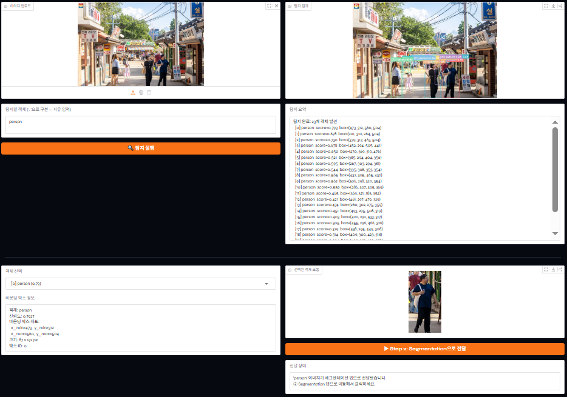
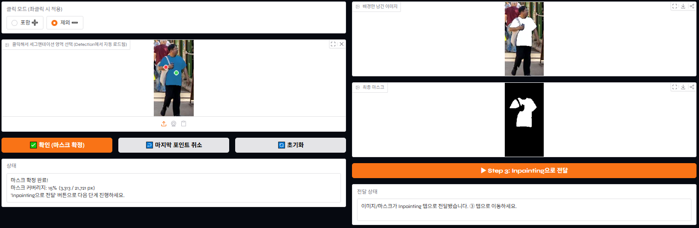
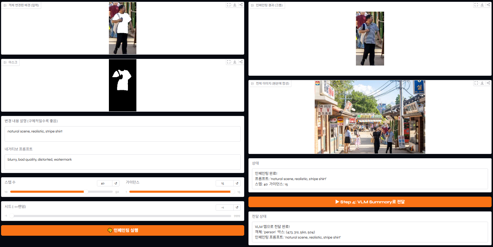
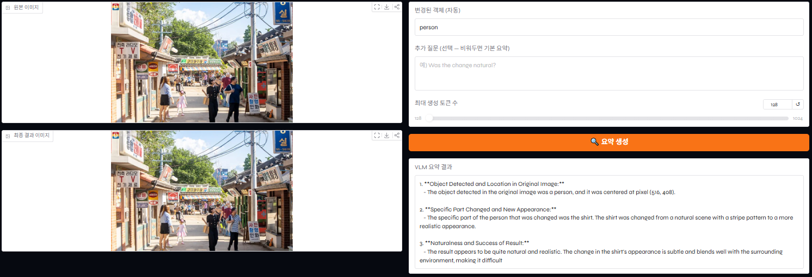

# 🧹 Object Removal & Change Pipeline

> **Detection · Segmentation · Inpainting · VLM** 4개의 파운데이션 모델을 하나의 Gradio UI로 통합한 이미지 객체 제거·변경 파이프라인

이미지 속 객체를 텍스트로 **탐지**하고, 클릭 한두 번으로 정밀하게 **세그멘테이션**한 뒤, 해당 영역을 **인페인팅**으로 자연스럽게 바꾸고, 마지막으로 **VLM**이 "무엇이 어떻게 바뀌었는지"를 자연어로 요약합니다.

---

## 📌 한눈에 보는 흐름

```
①  Detection          ②  Segmentation       ③  Inpainting         ④  VLM Summary
   이미지 + 텍스트  →     클릭으로 마스크   →     배경/객체 복원   →     결과 자연어 요약
   (Grounding DINO)      (SAM2)                (Stable Diffusion)    (Qwen2.5-VL)
```

각 단계의 출력이 다음 단계의 입력으로 자동 전달되므로, 사용자는 **"전달" 버튼만 누르며 탭을 순서대로 이동**하면 됩니다. 각 모듈은 단독으로도 실행할 수 있습니다(인페인팅 제외).

---

## 🔧 사용 모델

| 단계 | 모델 | 역할 |
|------|------|------|
| ① Detection | [Grounding DINO tiny](https://github.com/IDEA-Research/GroundingDINO) | 자유 텍스트(open-vocabulary)로 객체 탐지 |
| ② Segmentation | [SAM2 hiera-tiny](https://github.com/facebookresearch/segment-anything-2) | 클릭 기반 인터랙티브 세그멘테이션 |
| ③ Inpainting | [Stable Diffusion 1.5](https://huggingface.co/runwayml/stable-diffusion-v1-5) | 마스크 영역 복원/변경 (파이프라인 전용) |
| ④ VLM Summary | [Qwen2.5-VL-3B](https://huggingface.co/Qwen/Qwen2.5-VL-3B-Instruct) | 이미지 기반 자연어 질의응답 |

---

## 🚀 빠른 시작

### 1. 패키지 설치

```bash
pip install -r requirements.txt
```

### 2. 통합 파이프라인 실행

```bash
python main.py
# 접속 주소: http://localhost:7860  (브라우저 자동 실행)
```

실행하면 4개 모델이 순차적으로 로드됩니다. 콘솔에 아래와 같은 진행 상황이 출력되고, 로드가 끝나면 브라우저가 자동으로 열립니다.

```
============================================================
  Object Change Pipeline
  Detection · Segmentation · Inpainting · VLM
============================================================

[1/4] Detection 모델 로드...       (Grounding DINO tiny · cuda)
      ✓ 완료
[2/4] Segmentation 모델 로드...    (SAM2 hiera-tiny · cuda)
      ✓ 완료
[3/4] Inpainting 모델 로드...      (Stable Diffusion 1.5 · cuda)
      ✓ 완료
[4/4] VLM 모델 로드...             (Qwen2.5-VL-3B · cuda)
      ✓ 완료
```

> 💡 `main.py`는 `share=True`로 실행되므로, 콘솔에 출력되는 공개 `*.gradio.live` 링크로 외부에서도 접속할 수 있습니다.

---

## 🔗 통합 파이프라인 사용법 (main.py)

아래 예시는 거리 사진에서 한 사람의 **옷(셔츠)을 다른 스타일로 바꾸는** 과정입니다. 각 탭을 순서대로 따라가면 됩니다.

### Step 1 — ① Detection (객체 탐지)



자유 텍스트로 객체를 탐지하고, 그중 바꿀 대상 하나를 골라 크롭합니다.

1. 왼쪽 위 **이미지 업로드**에 사진을 올립니다.
2. **탐지할 객체** 칸에 찾고 싶은 대상을 입력합니다. 여러 개는 `. `(마침표+공백)으로 구분합니다. (예: `person . car . dog`)
3. **🔍 탐지 실행**을 누르면 오른쪽에 바운딩 박스가 그려진 결과 이미지와, `[0] person score=0.793 box=(...)` 형식의 **탐지 요약**이 표시됩니다.
4. 아래 **탐지된 객체 선택** 드롭다운에서 바꿀 대상을 고르면, 오른쪽에 해당 객체의 **크롭 이미지**와 신뢰도·박스 좌표가 나타납니다.
5. **▶ Step 2: Segmentation으로 전달**을 클릭합니다.

| 항목 | 내용 |
|------|------|
| **입력** | 이미지, 탐지 텍스트(`. `로 구분) |
| **출력** | 박스가 그려진 결과 이미지, 탐지 객체 목록·신뢰도, 선택 객체 크롭 |

---

### Step 2 — ② Segmentation (클릭으로 영역 지정)



Detection에서 넘어온 크롭 이미지 위를 클릭해 정밀한 마스크를 만듭니다.

1. **클릭 모드**를 선택합니다. **포함 ➕**(좌클릭으로 영역 추가) / **제외 ➖**(원하지 않는 영역 빼기)를 자유롭게 전환할 수 있습니다.
2. 분리하려는 객체 위를 클릭합니다. 클릭할 때마다 마스크가 **즉시 갱신**됩니다.
3. 마스크가 마음에 들지 않으면 **↩️ 마지막 포인트 취소** 또는 **🔄 초기화**를 사용합니다.
4. 만족스러우면 **✅ 확인 (마스크 확정)**을 누릅니다. 오른쪽에 **배경만 남긴 이미지**와 **최종 마스크**, 그리고 마스크 커버리지(예: `15% (3,313 / 21,721 px)`)가 표시됩니다.
5. **▶ Step 3: Inpainting으로 전달**을 클릭합니다.

| 항목 | 내용 |
|------|------|
| **입력** | 크롭 이미지, 클릭 포인트(1개 이상) |
| **출력** | 마스크 오버레이, 배경만 남긴 이미지, 최종 마스크 |

---

### Step 3 — ③ Inpainting (영역 복원·변경)



마스크 영역을 프롬프트에 맞춰 새로 그려 넣습니다. 객체를 지워 배경으로 채우거나, 예시처럼 셔츠를 다른 스타일로 바꿀 수 있습니다.

1. 왼쪽에 전달된 **입력 이미지**와 **마스크**가 자동 표시됩니다.
2. **변경 내용 설명** 프롬프트를 입력합니다. 구체적일수록 결과가 좋습니다. (예: `natural scene, realistic, stripe shirt`)
3. **네거티브 프롬프트**로 피하고 싶은 결과를 지정합니다. (기본값: `blurry, bad quality, distorted, watermark`)
4. **스텝 수 / 가이던스 / 시드**를 조정합니다. (시드 `-1`은 매번 랜덤)
5. **🎨 인페인팅 실행**을 누르면 오른쪽에 **크롭 결과**와 **원본에 합성된 전체 이미지**가 함께 나타납니다.
6. 결과가 만족스러우면 **▶ Step 4: VLM Summary로 전달**을 클릭합니다.

| 항목 | 내용 |
|------|------|
| **입력** | 배경+마스크(자동), 프롬프트, 네거티브, 스텝/가이던스/시드 |
| **출력** | 인페인팅 크롭 결과, 원본 합성 전체 이미지 |

> ⚠️ Inpainting은 Segmentation이 만든 마스크를 필수 입력으로 사용하므로 **단독 실행을 지원하지 않습니다.** 반드시 `main.py`의 통합 파이프라인에서 사용하세요.

---

### Step 4 — ④ VLM Summary (결과 요약)



원본과 최종 결과를 VLM에 함께 입력해 "무엇이 어떻게 바뀌었는지"를 자연어로 정리합니다.

1. **원본 이미지**와 **최종 결과 이미지**, 그리고 **변경된 객체**(예: `person`)가 자동으로 채워집니다.
2. 궁금한 점이 있으면 **추가 질문**을 입력합니다. (예: `Was the change natural?`) 비워두면 기본 요약을 생성합니다.
3. **최대 생성 토큰 수**로 답변 길이를 조절합니다. (128 ~ 1024)
4. **🔍 요약 생성**을 누르면 객체 위치, 바뀐 부분, 결과의 자연스러움 등을 정리한 **VLM 요약 결과**가 표시됩니다.

| 항목 | 내용 |
|------|------|
| **입력** | 원본·결과 이미지(자동), 추가 질문(선택), 최대 토큰 수 |
| **출력** | 변경 내용에 대한 자연어 요약 |

---

## 🔬 모듈 단독 실행 (개별 데모)

파이프라인 연결 없이 각 모델만 독립적으로 확인하고 싶을 때 사용합니다.

### ① detection.py
```bash
python detection.py        # http://localhost:7860
```
이미지와 탐지 텍스트(`. `로 구분)를 입력하면, 박스가 그려진 결과·탐지 목록·선택 객체 크롭을 보여줍니다.

### ② segmentation.py
```bash
python segmentation.py     # http://localhost:7861
```
이미지를 올리고 객체 위를 클릭하면 마스크가 즉시 갱신됩니다. **확인**으로 마스크를 확정합니다.

### ③ inpainting.py
> **단독 실행 불가** — Segmentation 마스크를 필수 입력으로 사용하므로 `main.py` 파이프라인에서만 동작합니다.

### ④ vlm.py
```bash
python vlm.py              # http://localhost:7863
```
이미지 1장과 질문(선택)을 입력하면 VLM이 자연어로 답합니다. 질문을 비우면 이미지 전체 설명을 생성합니다.

---

## 📁 프로젝트 구조

```
.
├── main.py            # 통합 파이프라인 진입점 & Gradio UI 빌더
├── detection.py       # Grounding DINO 탐지 모듈 (단독 실행 가능)
├── segmentation.py    # SAM2 세그멘테이션 모듈 (단독 실행 가능)
├── inpainting.py      # Stable Diffusion 인페인팅 모듈 (파이프라인 전용)
├── vlm.py             # Qwen2.5-VL VLM 모듈 (단독 실행 가능)
├── utils.py           # 공유 상태(PipelineState) 및 유틸리티
├── requirements.txt   # 패키지 목록
└── assets/            # README용 스크린샷
```

### 탭 간 데이터 흐름

`main.py`는 모듈 간 상태를 `PipelineState`로 공유하며, 각 "전달" 버튼이 다음 단계로 데이터를 넘깁니다.

| 전달 버튼 | 넘기는 데이터 |
|-----------|---------------|
| ① → ② | 선택 객체의 크롭 이미지 (`set_seg_image`) |
| ② → ③ | 크롭 이미지 + 확정 마스크 + 원본/박스 좌표 (`set_inp_inputs`) |
| ③ → ④ | 원본 + 인페인팅 크롭 결과 + 객체 라벨/박스/프롬프트 (`set_vlm_inputs`) |

---

## 📋 요구 사항

- Python 3.9 이상
- CUDA 지원 GPU 권장 (CPU에서도 동작하나 매우 느림)
- 최소 VRAM 6GB 이상 권장 (4개 모델 동시 로드)

---

## 🛑 종료

```
Ctrl + C
```